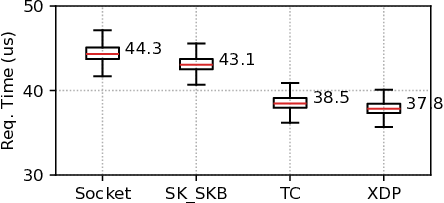
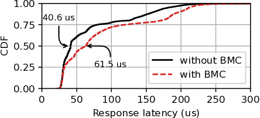
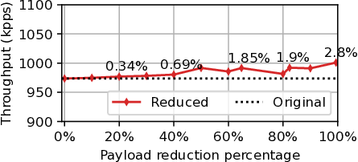

# Artifact Guide for "Demystifying Performance of eBPF Network Applications"

## Experiment Setup
Experiments were performed using two servers connected back-to-back via 100
Gbps links through Mellanox ConnectX-6 NICs. Servers were equipped with the
Intel Xeon Silver 4310 CPU running at 2.10GHz with 24 CPU cores. The CPU has
1.1 MB of L1 cache, 30 MB of L2 cache, and 36 MB of L3 cache. Servers have 128
GB DDR4 memory with 3200 MHz frequency.  Each machine has two NUMA nodes. In
the experiments, programs were configured to run on the same NUMA node
connected to the NIC. Linux kernel version 6.8.0-rc7 was installed on the test
machine. We used version 14 of the clang for compiling the eBPF programs and
targeted version 3 of the eBPF ISA. Simultaneous multithreading
(hyperthreading) and Intel Turbo Boost were disabled during experiments.

[This script was used to configure system, e.g., hyperthreading, turboboost, flow-steering, ...](./scripts/setup_exp.sh)

# Experiments

## Table 1: Time to reach a hook and prepare the object

|Hook|Time to reach (ns) | Prep. (ns)|
|:---|:-----------------:|:---------:|
|XDP| 0| 38|
|TC|273 ± 51| 35|
|SK_SKB|1072 ± 65|1350|
|Socket|5738 ± 779|-|

Time to reach an eBPF hook and prepare the execution environment. The origin of time measurement is the NIC driver.

> [Experiment details](./exp_info/table1.md)

## Figure 3: Offloading an echo server to different hooks

Moving a complete path of application logic to
the kernel can improve performance (latency). Figure
shows an echo server offloaded to different eBPF hooks.

> [Experiment details](./exp_info/figure3.md)

## Figure 4: Performance interference for slow-path flows when offloading fast-path to eBPF

Partial offloading of Memcached to eBPF/XDP
degrades the performance of user-space traffic (while
the fast-path enjoys performance improvement).

> [Experiment details](./exp_info/figure4.md)

## Table 2: Attaching eBPF program decreases the bandwidth measured by `ipef`

|Scenario | Bandwidth (Gbps)|
|:--------|:---------------:|
|No eBPF | 7.24 ± 0.64|
|XDP | 7.14 ± 0.22 |
|TC | 7.02 ± 0.89 |
|SK_SKB | 6.22 ± 0.3 |

Attaching a minimal eBPF program to data-path increases the in-kernel processing and decreases bandwidth measured by `iperf`.

> [Experiment details](./exp_info/table2.md)

## Figure 5: Preprocessing and reducing data in XDP

Reducing the packet size before copying to user-space does not provide significant throughput benefits.

> [Experiment details](./exp_info/figure5.md)
