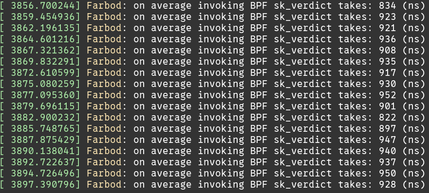

# Complete Guide To Reporducing Everthing

> Please be kind with the codes, commands, and machines you're using. It takes time and understanding :)

## Hardware

Get two c6525-100g servers from Cloudlab Utah cluster with Ubuntu-22 image.

## Setup

Clone the repository and run `make prepare_env`

> Make sure there are no errors!

## Table 1:

> paper results are at: /docs/experiments/time\_to\_hook

### Setup

Go to `/others/linux-6.8.7/`. This directory holds the patched kernel.
We need to enable the measurements we want to do and compile and reinstall the
kernel.

Edit these files and uncomment the mentioned line (define the flags for
measuring different overhead and durations):


* ./net/core/skmsg.c (line 15)
- `#define MEASURE_SK_SKB_OVERHEAD 1`

* ./net/sched/cls\_bpf.c (line 84)
- `#define MEASURE_TC_OVERHEAD 1`

* ./drivers/net/virtio\_net.c (line 1051)
- `#define MEASURE_VIRTIO_XDP_OVERHEAD 1`

* ./net/core/dev.c (line 4926)
- `#define MEASURE_GENERIC_XDP_OVERHEAD 1`

* ./include/linux/test\_timer.h (line 118)
- `#define MEASURE_TIME_TO_REACH_HOOK 1`


Build and install the kernel with these flags enabled.
If the `make prepare_env` has succeeded, then the kernel is already configured
and there is a `build` directory.

```
cd ./build/
make -j 40
sudo make modules_install
sudo make install
# sudo reboot # <-- reboot the system and boot with the new kernel
```

> Make sure you are using the new kernel with this command `uname -r`. The value must be `6.8.7art`.

Make sure the MTU of your Mellanox interface is set to 1500 (by default it can be 9000)

```
sudo ip link set dev $NET_IFACE mtu 1500
```

### Experiment and Measure

Run `script/setup_exp.sh` to configure the system. Hitting Ctrl-C will bring
back the system configuration back to normal.

> Make sure the UDP & TCP traffic are redirected to single queue using `ethtool -u $NET_IFACE`. There must be two rules for this.

**Overhead of Each Hook (Preparing Context, Entring, and Exiting The Hook**

Run an iperf server on port **8080**.

```bash
iperf -s -p 8080
```

Go to `src/` directory and load a minimal eBPF program and attach it to a hook.
Test each hook separately.

- for SK\_SKB:

```bash
sudo ./build/loader -i $NET_IFACE -b ./build/bpf/bpf_pass_perf.o --skskb verdict
```

- for TC:

```bash
sudo ./build/loader -i $NET_IFACE -b ./build/bpf/bpf_pass_perf.o --tc tc_prog
```

- for XDP:

```bash
sudo ./build/loader -i $NET_IFACE -b ./build/bpf/bpf_pass_perf.o --xdp xdp_prog
```

Run iperf client and generate traffic toward the server. The overhead of each hook is logged in `dmesg`.

```bash
iperf -c 192.168.1.1 -p 8080 -l 128 -t 100
```

Seeing the log:

```
sudo dmesg -w
```

> You can gather the values and use the `./docs/latency_script.py` to calculate the distribution of values and report "median +- interquantile range"



**Time to reach to a hook**

For measuring time to reach a hook run a UDP iperf server on port **3030**

```
iperf -s -u -p 3030
```

Attach a minimal program to TC, or SK\_SKB.
Test each hook separately.

- for SK\_SKB:

```bash
sudo ./build/loader -i $NET_IFACE -b ./build/bpf/bpf_pass_perf.o --skskb verdict
```

- for TC:

```bash
sudo ./build/loader -i $NET_IFACE -b ./build/bpf/bpf_pass_perf.o --tc tc_prog
```

Run iperf client and generate traffic toward the server. The time to reach each
hook is logged in `dmesg`.

```bash
iperf -u -c 192.168.1.1 -p 3030 -l 128 -t 100

```

Seeing the log:

```
sudo dmesg -w
```


## Figure 3

### Experiment and Measure

This experiment meausre the latency of echoing back packets at different hooks.

Use the client provided at `./scripts/echo_latency` to measure the latency.
At the top of `./scripts/echo_latency/main.c` file you can hard code the client
and server's IP address and compile the program using `make` command.

The socket echo server is `server_bounce` that you can run with the following
command.

```
sudo ./build/server_bounce 4 192.168.1.1 8080 0
```

The arguments of program is as shown below.

```
usage: prog <core> <ip> <port> <mode>
  * mode: 0: UDP    1: TCP
```

* For Socket:

- Run `server_bounce` and run the provided clinet. Terminate the clinet after some time, it will write the measured latencies in a filed named `samples.txt` at the current directory. The values are in *nanoseconds*.

* For SK\_SKB:

- Load \& attach XDP program

```
sudo ./build/loader -i $NET_IFACE -b ./build/bpf/bpf_redirect.o --skskb verdict
```

- Run `server_hook_timestamp` program! (Our SK\_SKB programs can automatically attach to TCP socket but UDP sockets should explicitly inserted! That's the reason why we use different program instead of `server_bounce`.)

```
sudo ./build/server_hook_timestamp 10 192.168.1.1 8080 0 --connect-client 192.168.1.2 --connect-client-port 3000
```

- Run the clinet

* For TC:

- Find the interface index of your experiment NIC using

```
ip -json addr show $NET_IFACE
```

- Update the `./src/bpf/bpf_redirect.bpf.c (line: 191)` file with the index you found and compile (run `make`).


- Attach the eBPF program

```
sudo ./build/loader -i $NET_IFACE -b ./build/bpf/bpf_redirect.o --tc tc_prog
```

- Run the clinet

* For XDP:

- Load \& attach XDP program

```
sudo ./build/loader -i $NET_IFACE -b ./build/bpf/bpf_redirect.o --xdp xdp_prog
```

- Run the clinet

