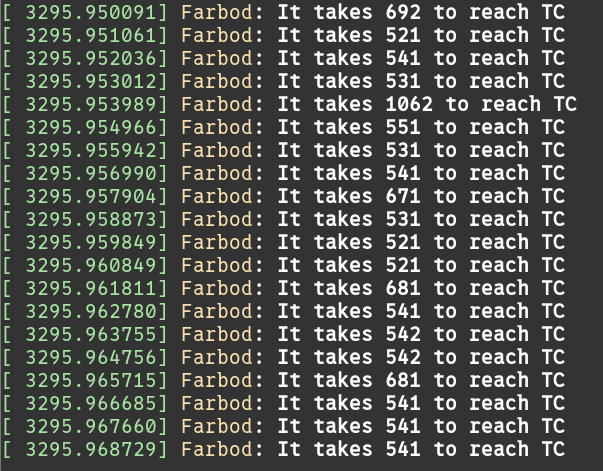

# Complete Guide To Reproducing Everything

This document describes the steps to repodruce the results from the paper
["Demystifying Performance of eBPF Network Applications"](./paper.pdf).
The experiments are discussed in the order of appearance in the paper.

*Please be kind with the codes, commands, and machines you're using. It has
taken us a lot of time and many surprises to do these test. It will require
time and understanding to repeat them. :)*

Contact
<a href="mailto:farbod.shahinfar@polimi.it?subject=[CoNEXT'25] Demystifying Performance of eBPF Network Applications">farbod.shahinfar [at] polimi.it</a>
regarding your questions.


## Hardware

Experiments were performed using two servers connected back-to-back via 100
Gbps links through Mellanox ConnectX-6 NICs. Servers were equipped with the
Intel Xeon Silver 4310 CPU running at 2.10GHz with 24 CPU cores. The CPU has
1.1 MB of L1 cache, 30 MB of L2 cache, and 36 MB of L3 cache. Servers have 128
GB of DDR4 memory with 3200 MHz frequency.  Each machine has two NUMA nodes.
Programs were configured to run on the same NUMA node connected to the NIC. We
used Linux kernel version 6.8.0-rc7, version 14 of the clang for compiling the
eBPF programs and targeted version 3 of the eBPF ISA (`-mcpu=v3`).

**The experiments in the paper were not performed on Cloudlab machines. But we
tested them on following Cloudlab machines for the sake of reproducibility.**

Get two sm110p servers from Cloudlab Wisconsin cluster with Ubuntu-22 image.

## Setup

* For preparing the load-generator machine look at [LOAD_GENERATOR.md](./LOAD_GENERATOR.md).
* For preparing the DUT  machine look at [DUT.md](./DUT.md).


## Table 1:

### Experiment

**Overhead of Each Hook (Preparing Context, Entring, and Exiting The Hook**

Run an iperf server on port **8080**.

```
iperf -s -p 8080
```

Go to `src/` directory and load a minimal eBPF program and attach it to a hook.
Test each hook separately.

  - for SK\_SKB:

  ```
  sudo ./build/loader -i $NET_IFACE -b ./build/bpf/bpf_pass_perf.o --skskb verdict
  ```

  - for TC:

  ```
  sudo ./build/loader -i $NET_IFACE -b ./build/bpf/bpf_pass_perf.o --tc tc_prog
  ```

  - for XDP:

  ```
  sudo ./build/loader -i $NET_IFACE -b ./build/bpf/bpf_pass_perf.o --xdp xdp_prog
  ```

Run iperf client and generate traffic toward the server. The overhead of each hook is logged in `dmesg`.

```
iperf -c 192.168.1.1 -p 8080 -l 128 -t 100
```

Seeing the log:

```
sudo dmesg -w
```

> You can gather the values and use the `./docs/latency_script.py` to calculate the distribution of values and report "median +- interquantile range"


**Time to reach to a hook**

For measuring time to reach a hook run a UDP iperf server on port **3030**

```
iperf -s -u -p 3030
```

Attach a minimal program to TC, or SK\_SKB.
Test each hook separately.

  - for SK\_SKB:

  ```
  sudo ./build/loader -i $NET_IFACE -b ./build/bpf/bpf_pass_perf.o --skskb verdict
  ```

  - for TC:

  ```
  sudo ./build/loader -i $NET_IFACE -b ./build/bpf/bpf_pass_perf.o --tc tc_prog
  ```

Run iperf client and generate traffic toward the server. The time to reach each
hook is logged in `dmesg`.

```
iperf -u -c 192.168.1.1 -p 3030 -l 128 -t 100
```

Seeing the log:

```
sudo dmesg -w
```




## Figure 3

### Experiment

This experiment meausre the latency of echoing back packets at different hooks.

Use the client provided at `./scripts/echo_latency` to measure the latency.
At the top of `./scripts/echo_latency/main.c` file you can hard code the client
and server's IP address and compile the program using `make` command.

The socket echo server is `server_bounce` that you can run with the following
command.

```
sudo ./build/server_bounce 4 192.168.1.1 8080 0
```

The arguments of program is as shown below.

```
usage: prog <core> <ip> <port> <mode>
  * mode: 0: UDP    1: TCP
```

* For Socket:

  - Run `server_bounce` and run the provided client. Terminate the client after some time, it will write the measured latencies in a filed named `samples.txt` at the current directory. The values are in *nanoseconds*.

* For SK\_SKB:

  - Load \& attach XDP program

  ```
  sudo ./build/loader -i $NET_IFACE -b ./build/bpf/bpf_redirect.o --skskb verdict
  ```

  - Run `server_hook_timestamp` program! (Our SK\_SKB programs can automatically attach to TCP socket but UDP sockets should explicitly inserted! That's the reason why we use different program instead of `server_bounce`.)

  ```
  sudo ./build/server_hook_timestamp 10 192.168.1.1 8080 0 --connect-client 192.168.1.2 --connect-client-port 3000
  ```

  - Run the client

* For TC:

  - Find the interface index of your experiment NIC using

  ```
  ip -json addr show $NET_IFACE
  ```

  - Update the `./src/bpf/bpf_redirect.bpf.c (line: 191)` file with the index you found and compile (run `make`).


  - Attach the eBPF program

  ```
  sudo ./build/loader -i $NET_IFACE -b ./build/bpf/bpf_redirect.o --tc tc_prog
  ```

  - Run the client

* For XDP:

  - Load \& attach XDP program

  ```
  sudo ./build/loader -i $NET_IFACE -b ./build/bpf/bpf_redirect.o --xdp xdp_prog
  ```

  - Run the client


## Figure 4

### Experiment

**Baseline Memcached**

* Go to `/scripts/hlob_memcached_exp/` and use the `run_server_v2.sh` script to
launch a Memcached server.

```
SERVER_IP=192.168.1.1 NET_IFACE=$NET_IFACE ./run_server_v2.sh
```

* Run the Mutilate client. For measuring the maximum throughput sustained by
the system use script at `scripts/bmc_tail_call_overhead_exp/run_mutilate.sh`.
Copy the script in to the mutilate root directory on your load-generator
machine. Then update the server IP addresses and run it.
The script runs the throughput measurement 40 times.


**BMC: Fast Path for Memached**

* Use `run_server_v2.sh` with `bmc` argument to run Memcached with BMC. The `iface index` value is the one you found using `ip -json addr show $NET_IFACE`.

```
SERVER_IP=192.168.1.1 NET_IFACE=$NET_IFACE NET_IFACE_INDEX=<iface index> ./run_server_v2.sh bmc
```

* Run Mutilate. Use the same script as above (`run_mutilate.sh`).


## Figure 5 & Figure 6

Similar to previous experiment, use `run_server_v2.sh` to launch Memcached and
measure its latency under the workload specified in the paper (the script has
the workload parameters already set). Then run the Memcached with BMC
acceleration and repeat the experiments. The provided script will gather raw
latency measurements for each case, store the files in separate paths and use
the ingestion script provided to get the "baseline" and "with BMC" lines from
figures 5 and 6 in the paper.

* Running the Memcached (baseline)

  ```
  SERVER_IP=192.168.1.1 NET_IFACE=$NET_IFACE ./run_server_v2.sh
  ```

* Running Memcached with BMC

  ```
  SERVER_IP=192.168.1.1 NET_IFACE=$NET_IFACE NET_IFACE_INDEX=<iface index> ./run_server_v2.sh bmc
  ```

After running the server, on the load-generator machine use script
`/scripts/holb_memcached_exp/tre_run.sh` to generate traffic. For this purpose
copy the script to the install directory of Mutilate (Must be `~/gen/multilate`
if you followed instruction in [load-generator setup](./LOAD_GENERATOR.md)).
You must set the value for `SERVER_HOST` defined at the top of the
script to IP address of your Memcached server.
The results will be written to a folder pointed to by `OUTPUT_DIR` variable.
Set the path according to your system.

In the output directory, files with `m1_lat_samples_*.txt` are the latency
results of background flow (served in the fast-path by BMC if available) and
`m2_lat_samples_*.txt` are the latency results of foreground flow (always going
to the user-space).

For ingesting the raw latency data look at script provided here
`/docs/experiments/bpf_holb/cur/command.sh` it will generate four files:

* Files `all_lat_baseline.txt` and `all_lat_bmc.txt` are for figure 4.
* Files `m2_lat_baseline.txt` and `m2_lat_bmc.txt` are for figure 5.


## Figure 7, 8 & 9

These experiments are similar to the past two sections. Use the scripts in
`/xsk_cache/scripts/` to run the server (these use the AF\_XDP socket (XSK)).

* `run_normal.sh`: runs the user-space program without partial offload (baseline)
* `run_bmc.sh`: runs the user-space program with partial offload


On the load-generator machine, use the previously discussed (Look above and at
description for Figure 4 and Figure 5 & 6) scripts for measuring throughput and
latency of foreground and background flows.


## Table 2

### Description

This experiment investigates the overhead of different eBPF hooks on the path
of a packet going to user-space.

### Experiment

The script located at `/scripts/iperf_tput_exp.sh` runs this experiment. Copy
it to the load-generator machine.  Make sure you can ssh into the DUT machine
from load-generator machine.  In the script, set the `USER` to the username
used for ssh connection.  Set the `SERVER` to the IP address of DUT/server
machine's control NIC/interface, and `SERVER_EXP` to IP address of its
experiment NIC. `BENCHMARK_INSTALL_DIR` must be set to path at which you have
cloned this repository. Also set `SERVER_IFACE_NAME` to the name of the
server's experiment interface.

After configuring the script to access your DUT machine, run it. It will run
the `iperf` server on DUT, load and attach eBPF program to different hooks and
generate load. The results of measurement are stored in the path indicated by
`OUTPUT_DIR`.


## Figure 10

### Description

This figure explores effect of packet size on the throughput for the packets
going to the user-space. The intuition is that small packets have lower memory
footprint and less memory copy overhead. The question is will reducing packet
size in the kernel increase the throughput for user-space applications?

### Experiment

Run a user-space program that just drops requests and reports throughput.

```
sudo ./build/server_drop 10 192.168.1.1 8080 0
```

We use the `bpf_summarize_3` benchmark for this experiment which reduces the
payload size of UDP packets for port 8080 to the value set by control-plane.
Load and attach the program to XDP with following command.

```
sudo ./build/loader -b ./build/bpf/bpf_summarize_3.o -i $NET_IFACE --xdp xdp_prog
```

Set the target size (size of new payload) using the following command.  `I` is
the path to the script that converts integers in to hex formatted string.
`SIZE` is a variable with the value for the target size we want to configure.
We use `bpftool` for configuring MAP (named `size_map`) with the new value.

```
export I=../scripts/int2hex.py; sudo bpftool
export SIZE=[new size]
map update name size_map key $(echo 0 | $I) value $(echo $SIZE | $I); sudo bpftool map dump name size_map
```

Generate traffic of UDP packets with size 1458 toward the system. The
user-space program (`server_drop`) reports the throughput.


## Table 3

### Description

This table reports time to access different collections.

### Experiment

The `bpf_map_lookup_access_time` benchmark is used for this experiment.
At the top of its source code, there are different flags controlling the type
of collections (MAPs) used in the experiment. Set them accordingly for the test
you want to do and recompile.


Run the benchmark with the following command:

```
sudo ./build/local_runner -b ./build/bpf/bpf_map_lookup_access_time.o -C 1
```

The output will be similar to figure below. Device the value shown as
`benchmark res` to 100000 (value of `REPEAT` defined in the source file)
to get the average access time.


## Figure 11 & 12

### Description

Experiment from figure 11 investigates the throughput of accessing three
different collection types (Array, Hash-map, and LRU hash-map) when their size
changes. The access pattern to the entries are uniform.

### Experiment

We use `bpf_map_access_throughput` benchmark in this experiment. At the top of
the source code there are configuration flags for selecting the type of
collection (MAP) and the its size. Configure them based on experiment you want
to repeat and *recompile*.
For measuring the throughput and cache-misses of baseline disable all flags.


Use the following command to attach the eBPF program:

```
sudo ./build/loader -b bpf_map_access_throughput.o -i $NET_IFACE --xdp xdp_prog
```

Generate UDP traffic toward the system (with destination port address of 8080,
the value set as `SERVER_PORT` in the program). For figure 11 the source IP and
destinations should be selected uniformly while the in figure 12 they are
selected from a Zipfian distribution.

Look at the log files for throughput:

```
sudo cat /sys/kernel/tracing/trace_pipe
```

For measuring cache-miss, use the `/scripts/measure_cache_miss.sh`.
Pass the core-number that is handling *softirq* and running XDP programs.

> The `setup_exp.sh` script steer flows to queue 3. Check the core that is handling its interrupts by looking at `/proc/interrupts` file and `/proc/irq/<irq-num>/smp_affinity_list`

```
sudo measure_cache_miss.sh $CPU_NUM
```


## Table 4

### Description

This experiment measure the access latency to different eBPF maps from user-space.

### Experiment

The `server_comm_map` user-space program is used along with `bpf_comm_map`
